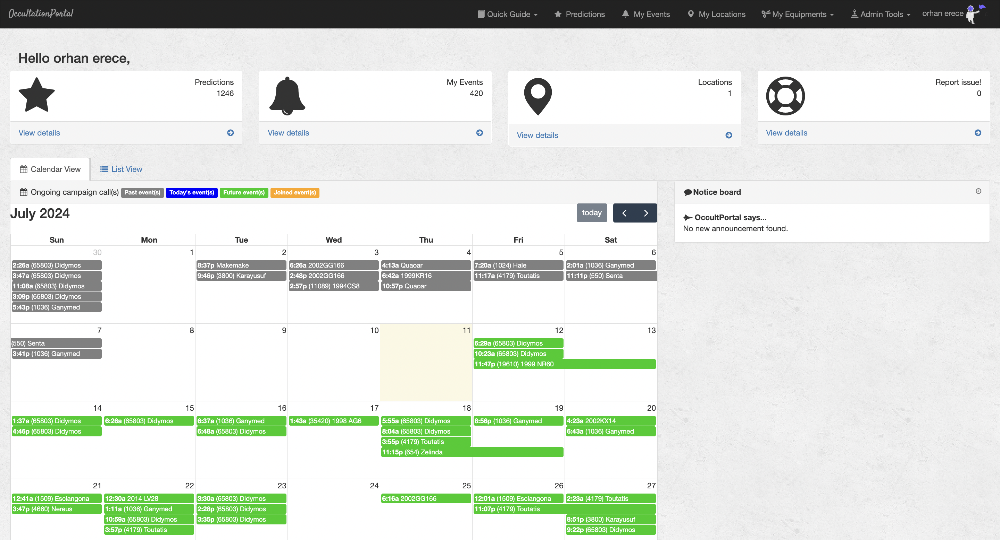

Getting Started
===============

This page is a guide for the use of the Occultation Portal

https://occultation.tug.tubitak.gov.tr/

Registring
----------

1 - **If it is your first access, go to** `Click Here`_ **link to register as shown below.**

.. _Click Here: https://occultation.tug.tubitak.gov.tr/register/

|

2 - **Provide the requested information on the page and submit.**

|
|

Requested information to register
   * *Username*
   * *First name*
   * *Last name*
   * *Email*
   * *Institution*
   * *Referral*
   * *Country*
   * *Password*

|
|
|

3 - **Check Your Mailbox.**

After submitting, you will need to access your e-mail to confirm the registration, as shown below.

.. image:: images/mail_register.png
   :alt: OP logo
   :height: 170px
   :align: center
   :class: no-scaled-link

After clicking on the link provided in the email, registration will be completed.
Now, go to the login page, enter your user name (not e-mail) and password.

Main Page
---------

The main page displays a calendar and events are shown here if exist for each day.

