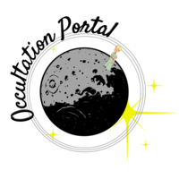

.. note:: If you have astronomical observation equipment such as a telescope,
          CCD, CMOS, or DSLR-like camera and wish to make advanced scientific
          contributions using this equipment, The Occultation Portal is the perfect place for you.
          Please read this document carefully to learn how you can
          contribute with your observation equipment. HELLO

Occultation Portal Documentation
================================

.. toctree::
   :maxdepth: 1

   introduction
   gettingstarted
   submit_event
   cite
   testfile
