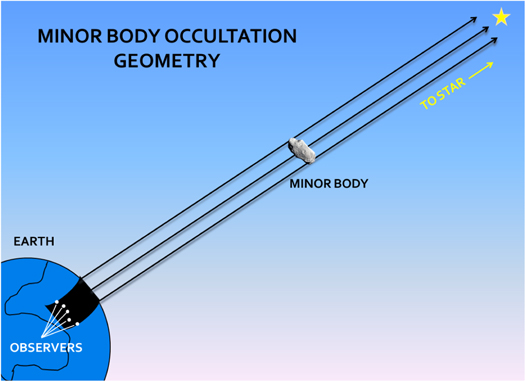

Introduction
============

The stellar occultation technique is a unique and reliable method to investigate the size, shape, and environment
around Solar System objects. One of the indispensables of this technique is multi-chord observations.
Sometimes collecting observational data and equipment details from observers affects prolonged research time.
For this reason, we aimed to create a common online platform where the needed data will be collected and analyzed
(producing light curves/photometry) on a single center for ongoing campaign observations.

..

|

Occultation Portal is a web-based astronomical archive and analysis platform for aiming the fast, efficient,
and centralized management of occultation observation campaigns called by the
`Lucky Star Project/Paris Observatory/LESIA`_
and the
`ACROSS Project`_. This platform is a scientific initiative conducted in partnership with a
`TÜBİTAK National Observatory (Turkey)`_, `Akdeniz University (Turkey)`_,
`The Federal University of Technology – Paraná (Brasil)`_, the
`Paris Observatory/LESIA Lucky Star Project (France)`_ and the
`Observatoire de la Côte d’Azur - Boulevard de l’Observatoire (France)`_.

| For detailed information about the Occultation Portal's software design and architecture, you can review the presentation at the `39th ESOP`_: `PDF`_ - `Video`_

.. _Lucky Star Project/Paris Observatory/LESIA: https://lesia.obspm.fr/lucky-star/
.. _ACROSS Project: https://lagrange.oca.eu/fr/home-across
.. _TÜBİTAK National Observatory (Turkey): https://tug.tubitak.gov.tr/
.. _Akdeniz University (Turkey): https://www.akdeniz.edu.tr/
.. _The Federal University of Technology – Paraná (Brasil): http://www.utfpr.edu.br/
.. _Paris Observatory/LESIA Lucky Star Project (France): https://lesia.obspm.fr/lucky-star/
.. _Observatoire de la Côte d’Azur - Boulevard de l’Observatoire (France): https://lagrange.oca.eu/fr/
.. _39th ESOP: https://esop39.iota-es.de/
.. _PDF: https://esop39.iota-es.de/lections/39th_ESOP_yucelkilic.pdf
.. _Video: https://esop39.iota-es.de/Videos/S5_2.mp4

Please go to :ref:`cite` section for referencing the OP.
